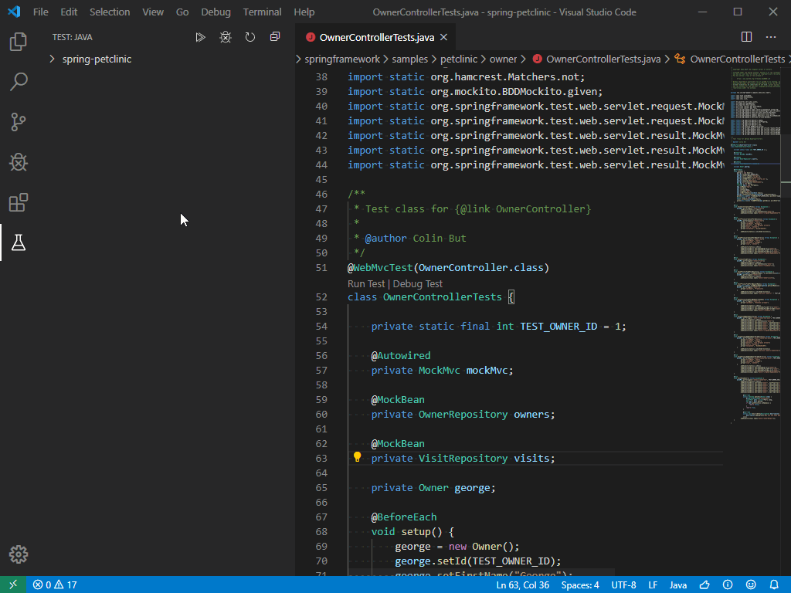

# Java Test Runner

> Run and debug Java test cases in Visual Studio Code

  

  
  
  
  

## Overview

A lightweight extension to run and debug Java test cases in Visual Studio Code. The extension support following test frameworks:

- JUnit 4 (v4.8.0+)
- JUnit 5 (v5.1.0+)
- TestNG (v6.8.0+)

The [Java Test Runner](https://marketplace.visualstudio.com/items?itemName=vscjava.vscode-java-test) works with [Language Support for Java by Red Hat](https://marketplace.visualstudio.com/items?itemName=redhat.java) and [Debugger for Java](https://marketplace.visualstudio.com/items?itemName=vscjava.vscode-java-debug) to provide the following features:

- Run/Debug test cases
- Customize test configurations
- View test report
- View tests in Test Explorer
- Show test logs

## Requirements

- JDK (version 1.8.0 or later)
- VS Code (version 1.23.0 or later)
- [Language Support for Java by Red Hat](https://marketplace.visualstudio.com/items?itemName=redhat.java)
- [Debugger for Java](https://marketplace.visualstudio.com/items?itemName=vscjava.vscode-java-debug)

## Quickstart

## Features

### Run/Debug Test Cases

  

- The extension will generate `Run Test` and `Debug Test` shortcuts (also known as Code Lens) above the class and method definition. Simply click on them will start running or debugging the target test cases.

> Note: If you cannot see the Code Lens in your editor, please refer to this [issue comment](https://github.com/Microsoft/vscode-java-test/issues/470#issuecomment-444681714) as a workaround.

---

### Test Explorer

  

- The Test Explorer is the place to show all the test cases in your project. You can also run/debug your test cases from here.
- Click the node in the Test Explorer will navigate to the location of the source code.

> Note: If the Test Explorer is empty, please refer to this [issue comment](https://github.com/Microsoft/vscode-java-test/issues/470#issuecomment-444681714) as a workaround.

---

### Customize Test Configurations

  

- Sometimes you may want to customize the configuration for running the test cases. To achieve this, you can add it into your workspace settings under the section: `java.test.config`.

> Note: More details can be found [here](https://github.com/Microsoft/vscode-java-test/wiki/Run-with-Configuration).

---

### View Test Report

  

- After running/debugging the test cases, the status bar will show the final results. Simply click on it to show the Test Report.
- You can also click the ✔️ or ❌ mark in Code Lens to open the Test Report.

  

- You can navigate to the source location of the target test case by clicking the navigate button.

> Note: You can use `java.test.report.showAfterExecution` to configure whether to automatically show the test report after execution. By default, it will be shown when there are failed tests. 

## Settings

| Setting Name | Description | Default Value |
|---|---|---|
| `java.test.report.position` | Specify where to show the test report. Supported values are: `sideView`, `currentView`. | `sideView` |
| `java.test.report.showAfterExecution` | Specify if the test report will automatically be shown after execution. Supported values are: `always`, `onFailure`, `never`. | `onFailure` |
| `java.test.log.level` | Specify the level of the test logs. Supported values are: `error`, `info`, `verbose`. | `info` |
| `java.test.config` | Specify the configuration for the test cases to run with. [More details](https://aka.ms/java-test-config). | `{}` |
| `java.test.defaultConfig` | Specify the name of the default test configuration. | `""` |

## Contributing and Feedback

If you are interested in providing feedback or contributing directly to the code base, please check the document [Contributing to Java Test Runner](https://github.com/Microsoft/vscode-java-test/blob/master/CONTRIBUTING.md), which covers the following parts:
- [Questions and Feedback](https://github.com/Microsoft/vscode-java-test/blob/master/CONTRIBUTING.md#questions-and-feedback)
- [Reporting Issues](https://github.com/Microsoft/vscode-java-test/blob/master/CONTRIBUTING.md#reporting-issues)
- [Contributing Fixes](https://github.com/Microsoft/vscode-java-test/blob/master/CONTRIBUTING.md#contributing-fixes)

## License

This extension is licensed under [MIT License](LICENSE.txt).

## Telemetry

This extension collects telemetry data to help improve our products. Please read [Microsoft privacy statement](https://privacy.microsoft.com/en-us/privacystatement) to learn more. If you opt out to send telemetry data to Microsoft, please set below configuration in settings.json: `telemetry.enableTelemetry = false`. Learn more in our [FAQ](https://code.visualstudio.com/docs/supporting/faq#_how-to-disable-telemetry-reporting).
